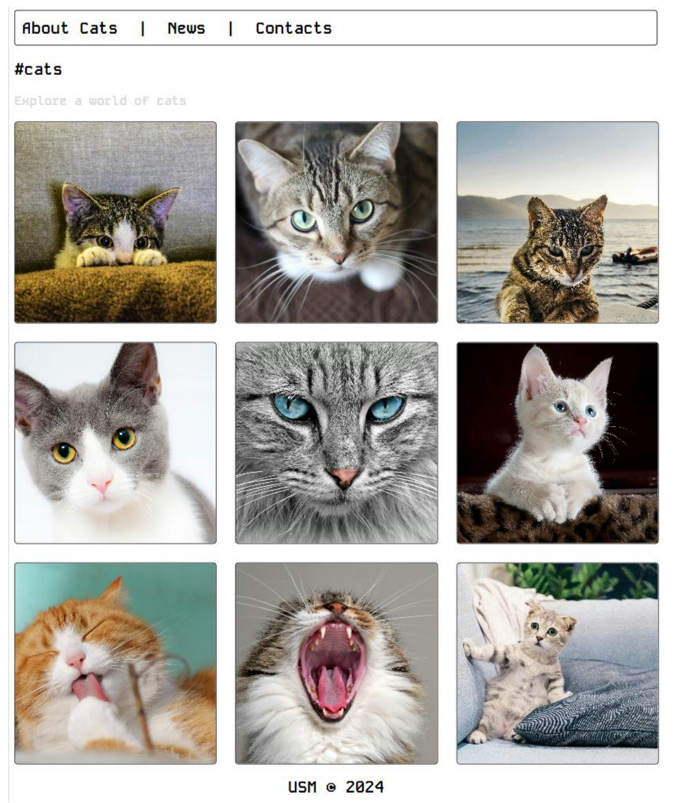

# Лабораторная работа 4. Циклы, массивы, функции

## Цель
Изучить основы работы с циклами, массивами и функциями в PHP. Научиться использовать ассоциативные массивы, генерировать данные с помощью циклов и выполнять базовые операции с файловой системой.

## Подготовка среды

1. Главный файл лабораторной работы должен называться `index.php`.
2. Используйте современные IDE, такие как **PhpStorm** или **Visual Studio Code**.
3. Для выполнения заданий запускайте веб-сервер одним из следующих способов:
   - **OpenServer**: сохраните файлы в директории `www/domains/localhost`.
   - **Встроенный сервер PHP**:
     ```bash
     php -S localhost:8000
     ```
     Выполните команду в терминале в директории, где находится файл `index.php`.
4. Для проверки работы скриптов откройте браузер:
   - Для **OpenServer**: `http://localhost/название_папки/`.
   - Для встроенного сервера PHP: `http://localhost:8000/`.

## Условие

### Задание 1: Цикл `for`
1. Создайте файл `index.php` со следующим кодом:
   ```php
   <?php

   $a = 0;
   $b = 0;

   for ($i = 0; $i <= 5; $i++) {
       $a += 10;
       $b += 5;
   }

   echo "End of the loop: a = $a, b = $b";
   ```

2. Добавьте вывод промежуточных значений `$a` и `$b` на каждом шаге цикла:

### Задание 2: Цикл `while`

1. Перепишите задание 1, используя цикл `while`:

### Задание 3: Работа с массивами
1. Создайте пустой массив `$numbers`.
2. Сгенерируйте массив случайных чисел от 1 до 100 с помощью цикла `for`:
3. Выведите массив в удобочитаемом формате:

### Задание 4: Ассоциативные массивы и функции
1. Определите следующий .php файл
    ```php
    <?php
    //определение ассоциативного массива транзакций
    $transactions = [
        [
            "transaction_id" => 1, // id
            "transaction_date" => "2019-01-01", // дата
            "transaction_amount" => 100.00, // сумма транзакции
            "transaction_description" => "Payment for groceries", // описание
            "merchant_name" => "SuperMart", // название организации
        ],
        [
            "transaction_id" => 2,
            "transaction_date" => "2020-02-15",
            "transaction_amount" => 75.50,
            "transaction_description" => "Dinner with friends",
            "merchant_name" => "Local Restaurant",
        ],
    ];
    ?>
    <table border="1">
        <tr style="background-color: #a6a6a6; color: #252525">
            <th colspan="4">Оценки студентов</th>
        </tr>
        <tr style="background-color: #a6a6a6; color: #252525">
            <th>ID</th>
            <th>Дата</th>
            <th>Сумма транзакции</th>
            <th>Описание транзакции</th>
            <th>Название организации</th>
        </tr>
        <?php
        foreach ($transactions as $transaction) { ?>
            <tr>
                <!-- Выведите на экран данные о транзакциях -->
            </tr>
        <?php } ?>
    </table>
    ```
2. Выведите транзакции в виде HTML-таблицы:
3. Добавьте ещё 2–3 транзакции в массив.
4. Создайте функции:
   - `calculateTotalAmount` для подсчёта общей суммы транзакций:
   - `calculateAverage` для вычисления среднего значения транзакций:
   - `mapTransactionDescriptions` для создания массива описаний транзакций:

> [!NOTE]
> Для удобства можете использовать функции `array_map()`, `array_reduce()`

#### Дополнительное задание

1. Добавьте класс `Transaction` с полями:
   - `id`, `date`, `amount`, `description`, `merchant`.
2. Создайте массив объектов класса `Transaction`.
3. Реализуйте методы для подсчёта общей суммы и среднего значения транзакций.
4. Вместо массива в пункте 4 определите массив из объектов класса.

### Задание 5: Работа с файловой системой

1. Создайте директорию "image", в которой сохраните не менее 20-30 изображений с расширением `.jpg`. Затем создайте файл `.php`, в котором  определите веб-страницу с хедером, меню, контентом и футером.
```php
<?php
// Задаем путь к папке с изображениями
$dir = 'image/';
// Сканируем содержимое директории
// scandir — Получает список файлов и каталогов, расположенных по  указанному пути.
// Возвращает array, содержащий имена файлов и каталогов, расположенных по  пути, переданному в параметре
$files = scandir($dir);

// Если нет ошибок при сканировании
if ($files === false) {
    return;
}
for ($i = 0; $i < count($files); $i++) {
    // Пропускаем текущий каталог и родительский
    if (($files[$i] != ".") && ($files[$i] != "..")) {
        // Получаем путь к изображению
        $path = $dir . $files[$i]; ?>
        <!-- Выведите картинку на экран ->
    <?php
    }
}
```

Приблизительный результат:

