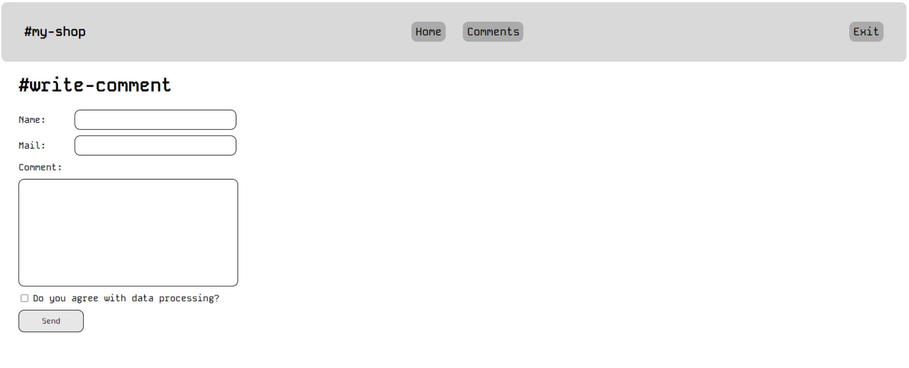

# Лабораторная работа 5. Обработка форм в PHP

## Цель

Познакомиться с глобальной переменной `$_POST` и обработкой данных из форм в PHP. Научиться валидировать пользовательские данные, работать с различными типами элементов формы, а также анализировать различия между `$_REQUEST` и `$_POST`.

## Условие

### Задание 1: Работа с глобальной переменной `$_POST`

1. Изучите следующий код и проанализируйте его работу:
```php
<div class="form">
    <form action="<?php echo $_SERVER['PHP_SELF'] ?>" method="POST">
        <fieldset>
            <legend>Оставьте отзыв!</legend>
            <div id="main_info" style="display: flex; flex-direction: column; gap: 10px;">
                <div>
                    <label for="name">Имя:
                        <input type="text" name="name"/>
                    </label>
                </div>
                <div>
                    <label for="email">Email:
                        <input type="email" name="email"/>
                    </label>
                </div>
            </div>
            <div id="extra_info">
                <div>
                    <p><label for="review">Оцените наш сервис!</label></p>
                    <div style="display: flex; flex-direction: column;">
                        <p><input id="review" type="radio" name="review" value="10" checked>Хорошо</p>
                        <p><input id="review" type="radio" name="review" value="8">Удовлетворительно</p>
                        <p><input id="review" type="radio" name="review" value="5">Плохо</p>
                    </div>
                </div>
            </div>
            <div id="message_info">
                <div>
                    <p><label for="comment">Ваш комментарий: </label></p>
                    <textarea id="comment" name="comment" cols="30" rows="10" class="comment"></textarea>
                </div>
            </div>
            <div id="buttons" style="display: flex; flex-direction: row; gap: 10px; margin-top: 10px;">
                <input type="submit" value="Отправить"/>
                <input type="reset" value="Удалить"/>
            </div>
        </fieldset>
    </form>
    <!-- Добавьте сюда код, отображающий сообщение только после отправки формы -->
    <div id="result">
        <p>Ваше имя: <b><?php echo $_POST["name"] ?? ''; ?></b></p>
        <p>Ваш e-mail: <b><?php echo $_POST["email"] ?? ''; ?></b></p>
        <p>Оценка товара: <b><?php echo $_POST["review"] ?? ''; ?></b></p>
        <p>Ваше сообщение: <b><?php echo $_POST["comment"] ?? ''; ?></b></p>
    </div>
</div>
```

1. Добавьте код, который будет отображать данные только после отправки формы.

2. Реализуйте валидацию, проверяющую:
   - Заполнение всех полей.
   - Корректность введённого e-mail.

4. Объясните, что такое глобальные переменные `$_POST` и `$_SERVER["PHP_SELF"]`.

### Задание 2: Получение данных с различных контроллеров

1. Создайте форму с 5 различными элементами управления:
   - Минимум 1 `input` с типом `number`
   - Минимум 1 `select`
   - Минимум 1 `radio` или `checkbox`

2. Определите тему формы на своё усмотрение (например, регистрация на мероприятие).

3. Обработайте отправленные данные и выведите их на экран.

### Задание 3: Создание, обработка и валидация форм

1. Создайте форму, показанную на рисунке (Рисунок 1).



2. Реализуйте валидацию для следующих полей:
   - **Поле "name"**:
     - Минимальная длина: 3 символа.
     - Максимальная длина: 20 символов.
     - Запрет на использование цифр.
   - **Поле "mail"**:
     - Проверка, что адрес электронной почты соответствует стандартам.
   - **Поле "comment"**:
     - Должно быть заполнено.
     - Дополнительные критерии по вашему выбору.
   - **Галочка "Do you agree with data processing?"**:
     - Пользователь обязан её отметить перед отправкой формы.

3. Если пользователь ввёл данные корректно, выведите сообщение ниже формы.

4. Объясните, чем отличаются глобальные переменные `$_REQUEST` и `$_POST`.

6. **Дополнительно** (Данное задание не является оцениваемым, а помогает вам более  подробно погрузиться в изучение PHP)
   1. В качестве валидатора рассмотрите и изучите следующий [класс](https://gist.github.com/devrdn/34999922e3310610b97ecf8708384ece).

### Задание 4: Создание теста

1. Создайте форму теста с:
   - Тремя вопросами.
   - Элементами `input` с типом `radio` и `checkbox`.
   - Полем для ввода имени пользователя.

2. Реализуйте проверку заполнения всех полей формы и выберите ответы пользователя.

3. Выведите результаты теста на экран.

## Отчет

1. Отчет по лабораторной работе должен соответствовать [Гиду по написанию отчетов по лабораторным работам](../lab_guidelines.md).
